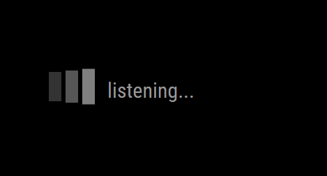

# MMM-Hotword2
MagicMirror module with Picovoice's Porcupine for Hotword detector. My previous `MMM-Hotword` module is deprecated due to `snowboy` hot-word detecting engine closing its service. Fortunately, PICOVOICE's Porcupine and its siblings would be good enough alternative. So I rebuilt the hot-word detector again.

## Features

- Multi Hotwords/ Custom Hotwords supported
- Individual Hotword setting
- On detection, various works possible;
  - Control other modules with custom notification
  - Execute Shell command or scripts and get the result.
- Not only hotword, but also continuous utterance could be acauired.(as recorded wav file)
  - The recorded file could be consumed on other STT / voice handling modules
- No need to rebuild for electron

For more details, [See the WIKI](https://github.com/MMRIZE/MMM-Hotword2/wiki)

You can discuss Usage/Tips in the [Discussions](https://github.com/MMRIZE/MMM-Hotword2/discussions)

You can report a bug or issue in the [Issues](https://github.com/MMRIZE/MMM-Hotword2/issues)

## Author
Seongnoh Yi (eouia0819@gmail.com)

[☕Buy a coffee.](https://ko-fi.com/eouia)
